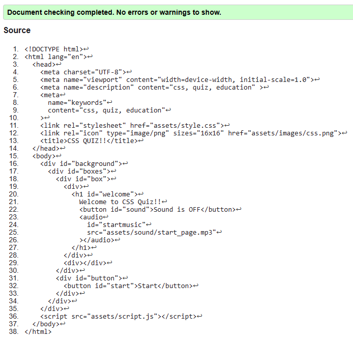

# CSS Quiz Project

## Project Overview

The CSS Quiz Project is an interactive web-based game designed to test knowledge in CSS. The game consists of a series of questions related to CSS properties and concepts. Players answer questions, accumulate points, and the game tracks their progress through a scoring system. The game is styled using CSS and controlled through JavaScript.

## Files in the Project

1. **index.html** - The starting page of the quiz game. It includes a welcome message, a start button, and background music control.
2. **gamezone.html** - The main quiz interface where questions are displayed, and users input their answers. It includes the score display, life tracker, and question navigation.
3. **gameover.html** - Displayed when the user loses all lives. It shows a game over message and a restart button.
4. **assets/style.css** - The CSS file for styling the starting page.
5. **assets/gamezone.css** - The CSS file for styling the quiz interface.
6. **assets/gameover.css** - The CSS file for styling the game over page.
7. **assets/script.js** - JavaScript for handling events on the starting page.
8. **assets/gamezone.js** - JavaScript for handling quiz logic, including question display, answer checking, and score management.
9. **assets/gameover.js** - JavaScript for handling events on the game over page.

## Features

- **Start Page**: Users are greeted with a welcome message and an option to control the background music.
- **Quiz Interface**: Users are presented with CSS questions and a text box to input their answers. The interface includes score tracking, remaining lives, and a button to proceed to the next question.
- **Sound Effects**: Interactive sound effects for correct or incorrect answers, which can be toggled on/off.
- **Progress Tracking**: The game tracks the user's score and remaining lives.
- **End Game Scenario**: On losing all lives, the user is directed to the game over page with an option to restart the quiz.

## How to Play

1. **Start the Game**: Open `index.html` in a web browser to start the game.
2. **Answer Questions**: In the quiz interface, type your answer to the CSS question and submit.
3. **Navigate**: Use the 'Next Question' button or the spacebar to proceed to the next question.
4. **Keep Track**: Monitor your score and remaining lives.
5. **Restart if Needed**: If you lose all your lives, use the 'Restart' button on the game over page to try again.

## Browser Compatibility

The game is compatible with modern web browsers like Chrome, Firefox, Safari, and Edge.

## Screenshots

### image of the start page

### image of the gamezone

### image of the gameover

### image of the css validator for start page

### image of the css validator for gamezone

### image of the css validator for gameover

### image of the html validator for start page

### image of the html validator for gamezone

### image of the html validator for gameover

### image of the performance by 'lighthouse'

## Future Enhancements

---

**Note**: This is a web-based game and requires a web browser to run. The project is best viewed on a desktop or laptop for optimal experience.
